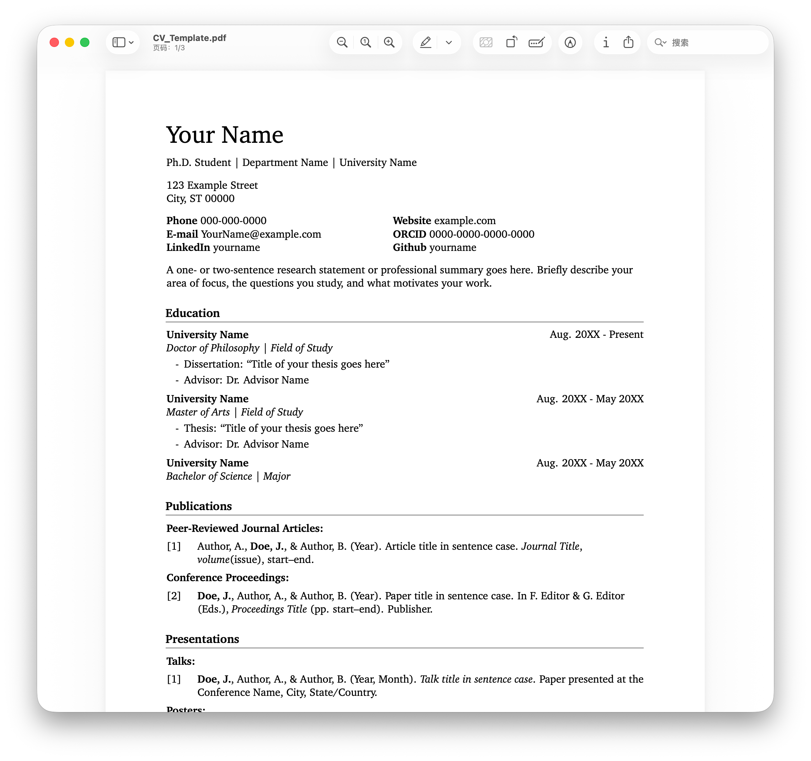

# Academic CV Template

A clean academic CV template for graduate students, PhD applicants, recent graduates, and early-career researchers.

  

## Preview

[View PDF Preview](https://hanyixu.com/files/CV_Template.pdf)

## What is included

- LaTeX CV template
- Word version
- Editable sections for education, publications, research, teaching, service, awards, skills, and languages
- Simple structure for academic applications and research-oriented job searches

## Who can use it

This template is suitable for graduate school applications, PhD applications, academic CVs, research positions, fellowships, and early-career job searches.

## How to use

Upload the files to Overleaf and edit `main.tex` and the section files.  
You can also use the Word version if you prefer Microsoft Word.

## License

MIT License
